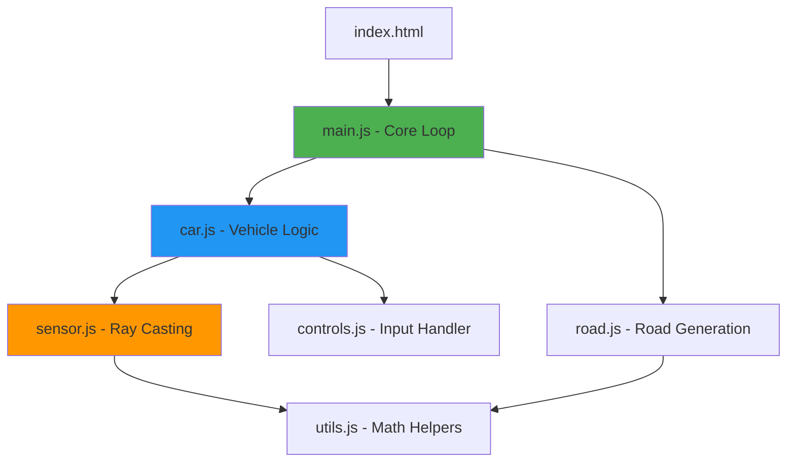

<div align="center">

# 🚗 Self-Driving Car Path Finding Automation

[](https://opensource.org/licenses/MIT)
[](https://developer.mozilla.org/en-US/docs/Web/JavaScript)
[](https://developer.mozilla.org/en-US/docs/Web/HTML)
[](https://developer.mozilla.org/en-US/docs/Web/API/Canvas_API)

**An interactive self-driving car simulation built entirely with vanilla JavaScript, showcasing intelligent pathfinding and collision detection using ray-casting sensors.**

[🎮 Try Demo](#-getting-started) • [📖 Documentation](#-project-overview) • [🤝 Contributing](CONTRIBUTING.md) • [📄 License](LICENSE)

</div>

---

## 📋 Table of Contents

- [🎯 Project Overview](#-project-overview)
- [✨ Key Features](#-key-features)
- [🏗️ Architecture](#️-architecture)
- [🛠️ Tech Stack](#️-tech-stack)
- [🚀 Getting Started](#-getting-started)
- [🎮 Controls](#-controls)
- [📁 Project Structure](#-project-structure)
- [🔧 How It Works](#-how-it-works)
- [🎨 Customization](#-customization)
- [🤝 Contributing](#-contributing)
- [💡 Future Enhancements](#-future-enhancements)
- [📝 License](#-license)
- [🙏 Acknowledgments](#-acknowledgments)

---

## 🎯 Project Overview

This project demonstrates a **self-driving car simulation** using intelligent pathfinding algorithms. Built from scratch with pure JavaScript and HTML5 Canvas, it features:

- 🚙 **Real-time car physics** with acceleration, friction, and steering mechanics
- 📡 **Ray-casting sensor system** for environment detection
- 🛣️ **Dynamic multi-lane road** generation with infinite scrolling
- 🎮 **Manual control mode** for testing and experimentation
- 🖥️ **Zero dependencies** - runs directly in any modern browser

> **Perfect for:** Learning game physics, understanding sensor-based navigation, and exploring autonomous vehicle concepts without complex frameworks.

---

## ✨ Key Features

<table>
<tr>
<td width="50%">

### 🎯 Core Functionality
- ✅ **Realistic Car Physics**
  - Acceleration & deceleration
  - Friction simulation
  - Angular steering mechanics
  - Forward/reverse movement

- ✅ **Intelligent Sensors**
  - 5-ray sensor array
  - 150-pixel detection range
  - Real-time collision detection
  - Visual sensor feedback

</td>
<td width="50%">

### 🎨 Visual & Interactive
- ✅ **Dynamic Viewport**
  - Camera follows the car
  - Smooth scrolling effect
  - Infinite road generation
  - 3-lane highway system

- ✅ **Interactive Controls**
  - Arrow key steering
  - Responsive input handling
  - Real-time physics updates
  - Smooth animations (60 FPS)

</td>
</tr>
</table>

---

## 🏗️ Architecture



---

## 🛠️ Tech Stack

<div align="center">

| Technology | Purpose | Version |
|:----------:|:-------:|:-------:|
|  | Core Logic | ES6+ |
|  | Structure | 5 |
|  | Styling | 3 |
|  | Graphics | HTML5 |

</div>

**Why Vanilla JavaScript?**
- 🎯 No build process or compilation
- 📦 Zero npm dependencies
- 🚀 Instant loading and execution
- 📚 Educational clarity and transparency

---

## 🚀 Getting Started

### Prerequisites

- A modern web browser (Chrome, Firefox, Edge, Safari)
- Basic understanding of HTML/JavaScript (for modifications)

### Installation & Running

1️⃣ **Clone the repository**
```bash
git clone https://github.com/YOUR_USERNAME/Car_path_find_automation.git
```

2️⃣ **Navigate to the project directory**
```bash
cd Car_path_find_automation
```

3️⃣ **Launch the simulation**
```bash
# Simply open index.html in your browser
# On Windows:
start index.html

# On macOS:
open index.html

# On Linux:
xdg-open index.html
```

**OR** just double-click `index.html` in your file explorer! 🎉

### Alternative: Local Server (Optional)

For the best experience, you can run it on a local server:

```bash
# Using Python 3
python -m http.server 8000

# Using Node.js (if you have http-server installed)
npx http-server

# Using PHP
php -S localhost:8000
```

Then navigate to `http://localhost:8000` in your browser.

---

## 🎮 Controls

<div align="center">

| Key | Action | Description |
|:---:|:------:|:------------|
| <kbd>↑</kbd> | **Accelerate** | Increase forward speed |
| <kbd>↓</kbd> | **Brake / Reverse** | Slow down or move backward |
| <kbd>←</kbd> | **Steer Left** | Turn the car left |
| <kbd>→</kbd> | **Steer Right** | Turn the car right |

</div>

### 🎯 Pro Tips

- Hold multiple keys for smooth diagonal movement
- Use reverse gear to unstick from road borders
- Watch the yellow sensor rays to understand detection
- The car automatically slows down due to friction

---

## 📁 Project Structure

```
Car_path_find_automation/
│
├── 📄 index.html           # Main HTML entry point
├── 📄 main.js              # Core animation loop & initialization
├── 📄 car.js               # Car class (physics & movement)
├── 📄 controls.js          # Keyboard input handler
├── 📄 sensor.js            # Ray-casting sensor system
├── 📄 road.js              # Road generation & rendering
├── 📄 utils.js             # Mathematical utility functions
├── 📄 style.css            # Minimal styling
│
├── 📖 README.md            # This file
├── 📖 CONTRIBUTING.md      # Contribution guidelines
└── 📄 LICENSE              # MIT License
```

### 📦 Module Breakdown

<details>
<summary><b>🚗 car.js</b> - Vehicle Logic</summary>

- Handles car position, speed, and angle
- Implements physics (acceleration, friction, steering)
- Integrates sensors and controls
- Provides drawing methods

</details>

<details>
<summary><b>📡 sensor.js</b> - Ray-Casting System</summary>

- Generates 5 sensor rays with 90° spread
- Detects intersections with road borders
- Returns distance to nearest obstacle
- Renders sensor visualization

</details>

<details>
<summary><b>🛣️ road.js</b> - Road Generation</summary>

- Creates multi-lane highway
- Defines road borders
- Calculates lane center positions
- Renders lane markings and borders

</details>

<details>
<summary><b>🎮 controls.js</b> - Input Handler</summary>

- Listens for arrow key events
- Updates control state (forward, reverse, left, right)
- Provides real-time input feedback

</details>

<details>
<summary><b>🧮 utils.js</b> - Math Utilities</summary>

- `lerp()`: Linear interpolation
- `getIntersection()`: Line segment intersection detection
- Used for sensor ray calculations

</details>

---

## � How It Works

### 🚦 The Main Loop

```javascript
function animate() {
    car.update(road.borders);      // 1. Update car physics & sensors
    canvas.height = window.innerHeight; // 2. Clear canvas
    
    ctx.save();
    ctx.translate(0, -car.y + canvas.height * 0.7); // 3. Follow car
    
    road.draw(ctx);                // 4. Draw road
    car.draw(ctx);                 // 5. Draw car & sensors
    
    ctx.restore();
    requestAnimationFrame(animate); // 6. Loop at 60 FPS
}
```

### � Sensor System

The car uses **ray-casting** to detect its environment:

1. **5 rays** fan out from the car (90° spread)
2. Each ray extends 150 pixels forward
3. Rays check for intersections with road borders
4. Shortest intersection distance is returned
5. Yellow lines show active detection, black shows free space

### 🎨 Physics Simulation

```javascript
// Acceleration & Friction
speed += acceleration  // When moving forward
speed -= friction      // Always applied
speed = clamp(speed, -maxSpeed/2, maxSpeed)

// Steering (only when moving)
angle += turnRate * (speed > 0 ? 1 : -1)

// Position Update
x -= sin(angle) * speed
y -= cos(angle) * speed
```

---

## 🎨 Customization

### 🔧 Easy Tweaks

Open `main.js` and modify:

```javascript
// Change canvas width (road width)
canvas.width = 200;  // Try 300 for wider road

// Change car starting lane (0 = left, 1 = middle, 2 = right)
const car = new Car(road.getLaneCenter(1), 100, 30, 50);
```

Open `car.js` to adjust physics:

```javascript
this.acceleration = 0.2;  // Increase for faster acceleration
this.maxSpeed = 4;        // Increase for higher top speed
this.friction = 0.05;     // Decrease for slipperier car
```

Open `sensor.js` to modify sensors:

```javascript
this.rayCount = 5;        // More rays = better detection
this.rayLength = 150;     // Longer rays = earlier detection
this.raySpread = Math.PI/2; // Wider spread = peripheral vision
```

### 🎨 Visual Customization

Modify colors in sensor drawing:

```javascript
// sensor.js
ctx.strokeStyle = "yellow";  // Change sensor color
ctx.strokeStyle = "black";   // Change "dead zone" color
```

Change road styling in `road.js`:

```javascript
ctx.strokeStyle = "white";   // Lane marking color
ctx.setLineDash([20, 20]);   // Dashed line pattern
```

---

## 🤝 Contributing

We welcome contributions! Whether you're fixing bugs, improving documentation, or adding new features, your help is appreciated.

### 🌟 Ways to Contribute

- 🐛 Report bugs by opening an issue
- 💡 Suggest new features
- 📝 Improve documentation
- 🔧 Submit pull requests

### 📋 Contribution Process

1. Fork the repository
2. Create a feature branch (`git checkout -b feature/AmazingFeature`)
3. Commit your changes (`git commit -m 'Add some AmazingFeature'`)
4. Push to the branch (`git push origin feature/AmazingFeature`)
5. Open a Pull Request

Please read [CONTRIBUTING.md](CONTRIBUTING.md) for detailed guidelines.

---

## 💡 Future Enhancements

### 🎯 Planned Features

- [ ] 🧠 **Neural Network Integration** - Add AI learning capabilities
- [ ] 🚗 **Traffic System** - Multiple AI cars to avoid
- [ ] 🏆 **Scoring System** - Track distance and performance
- [ ] 💾 **Save/Load State** - Persist progress in localStorage
- [ ] 🎨 **Multiple Car Models** - Different vehicle sprites
- [ ] 🛣️ **Complex Roads** - Curves, intersections, obstacles
- [ ] 📊 **Statistics Dashboard** - Real-time performance metrics
- [ ] 🌈 **Themes** - Day/night modes, different environments
- [ ] 🔊 **Sound Effects** - Engine sounds and collision audio
- [ ] 📱 **Mobile Support** - Touch controls for mobile devices

### 🚀 Advanced Ideas

- **Genetic Algorithm**: Evolve better driving strategies
- **Reinforcement Learning**: Train using Q-learning or PPO
- **Multiplayer Mode**: Race against friends
- **Track Editor**: Design custom road layouts
- **Replay System**: Record and playback runs

---

## 📝 License

This project is licensed under the **MIT License** - see the [LICENSE](LICENSE) file for details.

```
MIT License - You are free to:
✅ Use commercially
✅ Modify
✅ Distribute
✅ Private use
```

---

## 🙏 Acknowledgments

<div align="center">

### Special Thanks To

🎓 **Educational Resources**
- [HTML5 Canvas Tutorial](https://developer.mozilla.org/en-US/docs/Web/API/Canvas_API/Tutorial)
- [Game Physics Concepts](https://www.gamedev.net/)
- [Ray Casting Algorithms](https://en.wikipedia.org/wiki/Ray_casting)

� **Inspiration**
- Self-driving car research projects
- Classic arcade racing games
- Open-source game development community

👥 **Community**
- All contributors who have helped improve this project
- The open-source community for continuous inspiration
- Hacktoberfest participants

</div>

---

<div align="center">

### ⭐ Show Your Support

If you found this project helpful or interesting, please consider:

[](https://github.com/kartik912/Car_path_find_automation)
[](https://github.com/kartik912/Car_path_find_automation//fork)

**⭐ Star this repository** • **🍴 Fork and experiment** • **🤝 Contribute improvements** • **📢 Share with others**

---

**Made with ❤️ using Vanilla JavaScript**

[⬆ Back to Top](#-self-driving-car-path-finding-automation)

</div>
